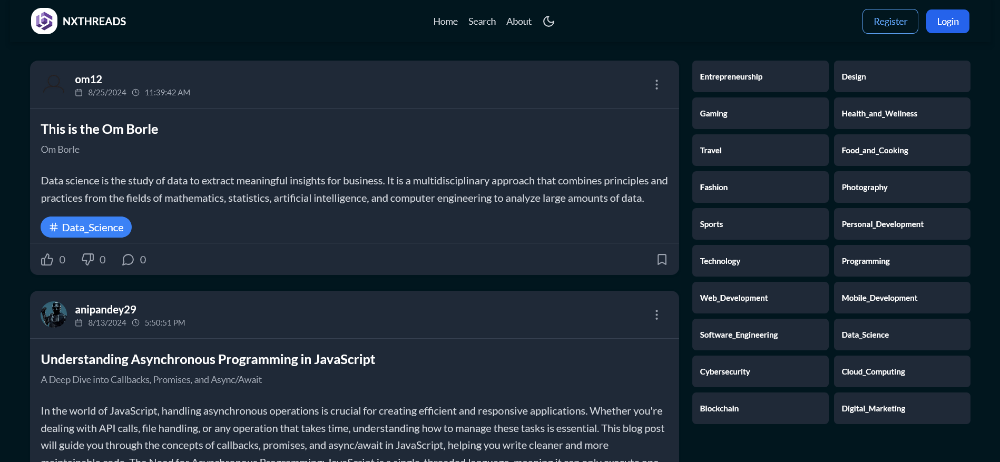
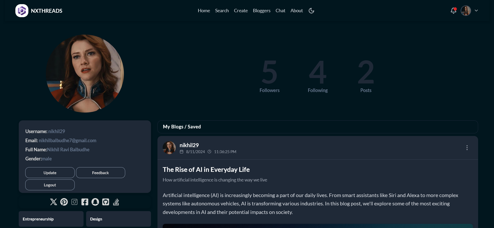
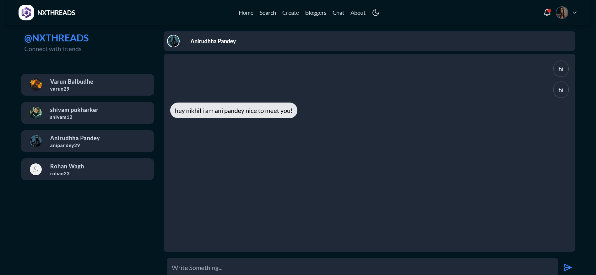
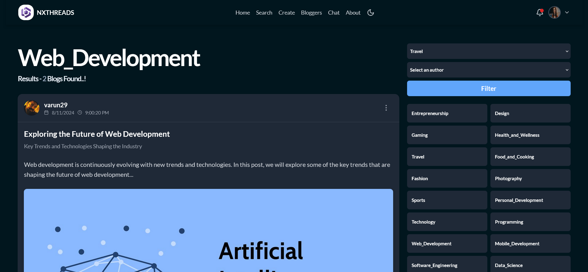
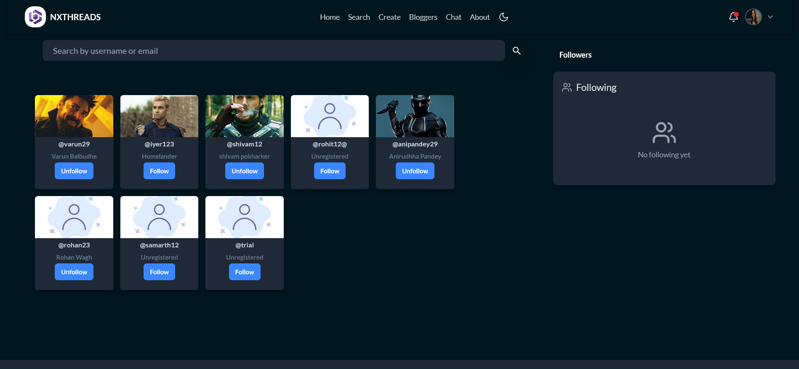
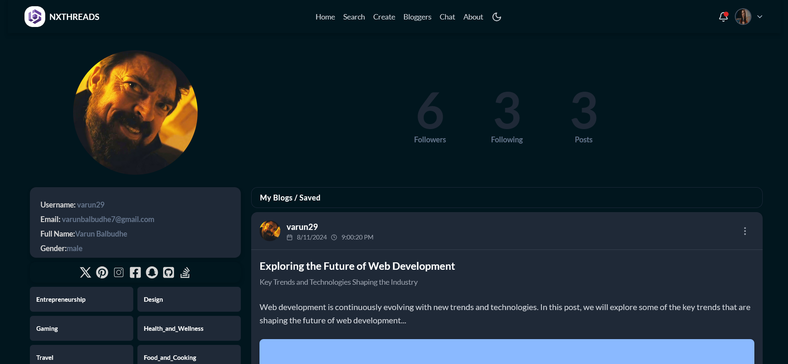
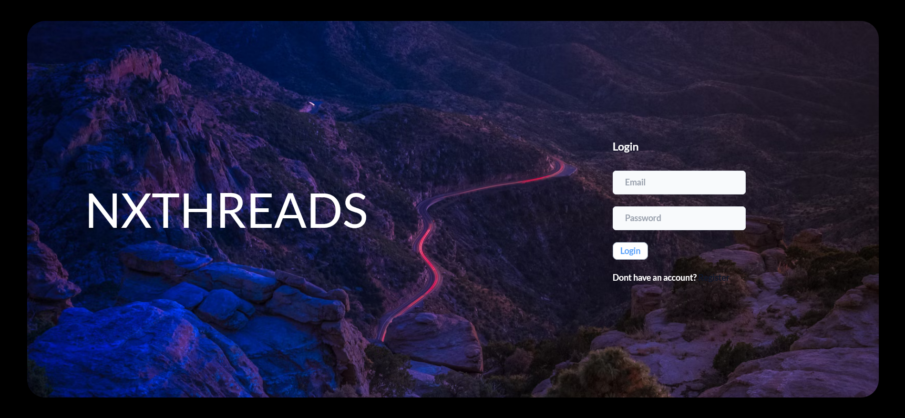

# NXTHREADS - The Next-Gen Blogging Platform

Welcome to **NXTHREADS**, a modern and dynamic blogsite where users can share their views, write about their experiences, and explore various topics such as **Blockchain, Technology, and Web Development**. The platform provides a seamless and interactive blogging experience with advanced features like multimedia support, social engagement, and a sleek UI.

---

## 🚀 Features

✅ **Multiple Blog Categories** - Write blogs on Blockchain, Technology, Web Development, and more.  
✅ **Rich Media Support** - Upload and embed **photos, videos, and text** in your blogs.  
✅ **User Interaction** - Follow bloggers, like, comment, and share blogs.  
✅ **Real-time Chat** - Engage in meaningful conversations with fellow bloggers.  
✅ **Advanced Search & Filters** - Find blogs and users easily with topic-based filters.  
✅ **Dark Mode** - Experience a visually appealing interface with dark mode.  
✅ **Secure & Scalable** - Built with a robust backend for a seamless experience.

---

## 🛠️ Tech Stack

- **Frontend:** React.js
- **Backend:** Node.js
- **Database:** MongoDB
- **Media Storage:** Cloudinary

---

The app will be live at `http://localhost:5173/` 🚀

---

## 📸 Screenshots

### Personalized Feed Page

### Profile Page

### Chat With Followers

### Category Wise Feed Pages

### Follow/Unfollow the Users

### Checkout Other Users Profile

### Login Page

---

## 🤝 Contributing

We welcome contributions! If you’d like to contribute:

- Fork the repository.
- Create a feature branch.
- Commit your changes.
- Create a pull request.

---

## 📬 Contact

For any queries or support, reach out to us at: **varunbalbudhe7@gmail.com**

---

## 🌟 Show Some Love

If you like this project, don’t forget to **star ⭐** the repository!